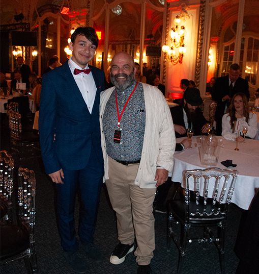
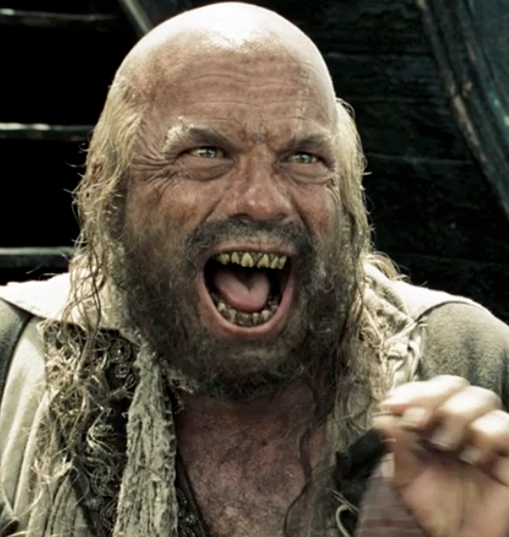
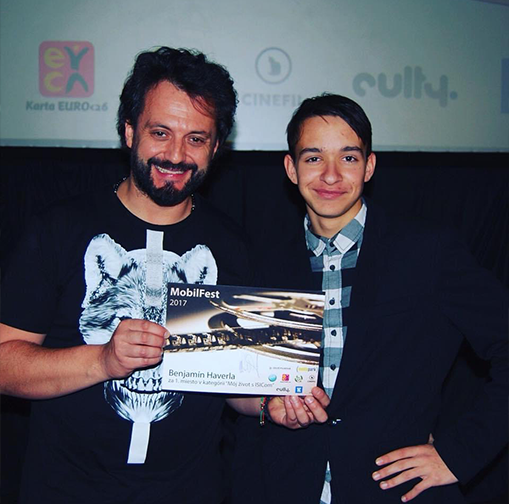

# ABOUT ME
 

My name is Benjamín Haverla, and I live in Martin, Slovakia. I believe that every step and decision in my life has influenced my personality and skills. I've decided to categorize my stories into chapters. This way, you can easily choose the field that interests you the most.

# Chapters of my life
- [The Story of My Study](https://github.com/BenjaminHaverla/The-Story-of-My-Study.git)
- [The Summary of My Life Story](https://github.com/BenjaminHaverla/Summary-of-my-life-story.git)

# Lee Arenberg (American actor) – beautiful conversation
When my short film ["THE LAST LETTER"](https://filmfreeway.com/projects/2082837) was nominated in the RED Movie Awards film festival, I had the opportunity to talk with the famous actor [Lee Arenberg](https://www.imdb.com/name/nm0034305/). He is best known for his role as Pintel, one of Captain Barbossa's crew, in the Pirates of the Caribbean franchise. He also had a recurring role as the dwarf Grumpy in the television series [Once Upon a Time](https://www.imdb.com/title/tt1843230/).

If you would like to know more about our conversation, don't hesitate to click here.

# Marián Čekovský – motivational talk
When I created at the age of 16 music video about [**"Life with ISIC"**](https://www.youtube.com/watch?v=07TXVp8rjss&t=9s), I had the opportunity to talk with the famous Slovak musician, singer, songwriter, comedian and presenter Marián Čekovský.

If you would like to know more about our conversation, don't hesitate to click here.

-------------------------------------------------------------

# BACK TO THE...
## [Main Page (English for designers)](https://github.com/BenjaminHaverla/English-for-designers.git)
## [Benjamín Haverla – Who am I ?](https://github.com/BenjaminHaverla/First-impression.git)
## [English essay – AWESOME](https://github.com/BenjaminHaverla/English-essay-workflow.git)
# Contact me:
## **Mail**: haverla.tros@gmail.com
